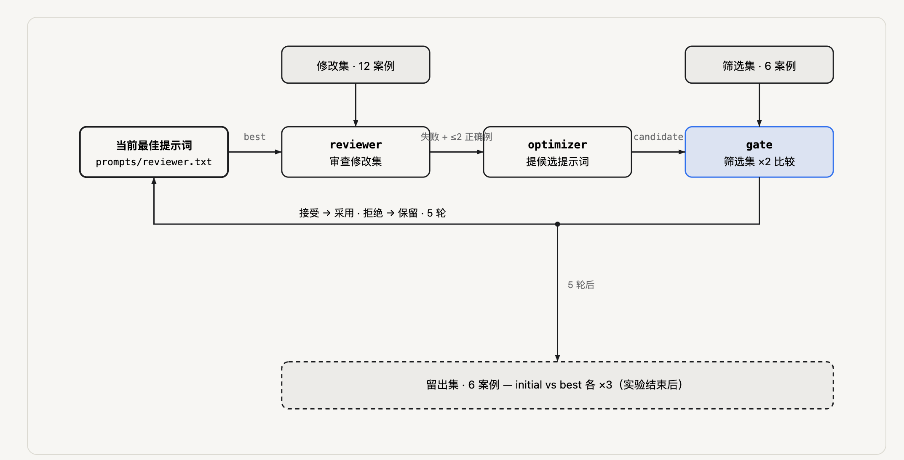

# Review Loop Lab：让模型根据审查错误优化提示词

一个 Python 3.10+ 标准库项目。只优化 `prompts/reviewer.txt` 的内容；模型、输出协议、数据和评分代码在一次实验内固定。

**本项目交付时没有真实模型效果数据。** `demo` 是预设响应的控制流演示，不能证明提示词优化有效；`live` 才会调用你配置的模型。项目没有内置 API Key。



*图：审查器在修改集产出错误与正确例，优化器据此提候选，程序在筛选集做两次对照决定采用或拒绝；留出集只在实验结束后比较初始版与最终版。*

## 先跑通（无需安装依赖，无需 API Key）

解压后进入 `review-loop-lab`：

```bash
python3 --version
python3 loop.py verify-fixtures
python3 -m unittest discover -s tests -v
python3 loop.py run --mode demo --out runs/demo-01
```

打开 `runs/demo-01/report.md`。演示预设为：第1轮采用，第2～3轮因退化拒绝，第4～5轮因持平拒绝。演示实现有意读取标准答案模拟输出，所有结果标记 DEMO。真实模式不把标签、解释、检查输入或分组发给审查器；优化器只能看到修改集反馈。

同一输出目录不得复用，避免覆盖历史记录。换成 `demo-02` 即可再次运行。

## 调用真实模型

使用支持 `POST /chat/completions`、`response_format: {"type":"json_object"}` 的兼容服务。默认地址为 DeepSeek 官方 API。模型名必须填写你账户当前支持的名称，项目不硬编码过时的模型名。

```bash
export LLM_BASE_URL="https://api.deepseek.com"
export LLM_MODEL="替换为账户可用的模型名"
export LLM_API_KEY="xxx"
python3 loop.py run --mode live --out runs/live-01
```

上面的隐式密钥输入适用于 Bash；也可由你自己的密钥管理工具设置环境变量。调用会把样例代码发给所选服务。

可选变量：`LLM_TEMPERATURE`（默认0）、`LLM_MAX_TOKENS`（默认4096）。模型若不支持这些参数或 JSON mode，需要先修改 `Client.ask()` 适配接口；不要忽略HTTP错误继续实验。固定温度不保证完全确定性。

```bash
# 先验证API连接和输出协议：1轮、留出集1次，通常49次调用
python3 loop.py run --mode live --out runs/smoke-01 --rounds 1 --holdout-repeats 1 --max-calls 60

# 正式实验：5轮、留出集各3次，候选都合法时221次调用
python3 loop.py run --mode live --out runs/live-02 --rounds 5 --holdout-repeats 3 --max-calls 250 --timeout 90
```

**先做冒烟运行，再另起一次固定配置的正式实验。** 如果根据冒烟测试的留出结果手调了提示词，这批留出数据已被使用，应另备新留出集。更严格的研究可自行加入只检查API连通性的调用，不触碰留出集。

没有并发或隐式重试。成本取决于服务商与模型；221次调用不承诺固定分钟数或价格。遇到网络错误、HTTP错误或调用预算耗尽会中止，写 `aborted.json`，不会生成成功结论。修好原因后使用新目录重跑。JSON/协议错误记录为无效输出，不能作为成功；有无效输出的筛选比较不能接受候选。

## 数据和任务边界

`data/cases.json` 包含24个人工构造的Python函数改动：12修改集、6筛选集、6留出集，每组正负例各半。每条含需求、before、after、类型标签、解释、执行检查。共有6种错误：边界、计算、过滤、输入副作用、状态、校验。

审查器看到需求、before、带行号after和diff。每条最多一个问题，必须输出问题类型、行号、触发条件、影响；无问题返回空数组。

这是教学用的单函数封闭任务，不是完整PR审查benchmark。类别已告知模型，案例很简单，强模型可能第一轮就全对。此时如实报告无提升；增加你真实遇到且确认过的案例，并为下一次实验重新冻结数据。不要为了制造提升故意削弱基线。

程序检查包内可信fixture代码的返回值和输入副作用；**不会执行LLM生成代码**。只有你信任并审阅过的代码才能加入这些可执行fixtures。通过有限测试不构成所有输入都正确的证明；正确案例还应人工审查。

## 采用规则与指标

每轮先用当前最佳提示词跑修改集，向优化器提供错误和至多两个正确案例。优化器提出一个完整候选、修改假设和潜在退化。然后新旧提示词在筛选集上各跑两遍，第二遍反转运行顺序。

两遍都满足以下条件才采用：

- 双方无无效输出；
- FP不增加、FN不增加；
- FP或FN至少一项严格下降。

持平保留旧版。每轮拒绝后下一轮仍从当前最佳版提出候选；这里不把拒绝的详细筛选结果交给优化器。默认跑足5轮，预算耗尽会中止。这种保守规则可能拒绝真实但微小的提升；教学重点是把决策明确写成代码。

评分匹配 `(case_id, kind)`：命中类型算TP；错报类型算FP；漏掉标准类型算FN；报错类型同时计一个FP和一个FN。格式错误单列errors，有bug时也计FN。Precision=TP/(TP+FP)，Recall=TP/(TP+FN)，无报告时precision为null而非100%。

**这些是问题类型指标，不是“意见有用率”。** 行号只验证范围，触发条件与影响只验证非空；程序不裁决解释正确性。使用 `audit.csv` 逐条人工复核：问题真实、触发路径成立、影响明确且值得修复，才标 useful=yes。可用意见数/全部意见数才是标题所说的“有用”。同一案例重复运行的意见应按各次运行分别统计，不能混成独立样本证明显著性。

最终才在6个留出案例上将初始版与最佳版各跑3次，输出均值和范围。重复运行检查波动，不增加案例多样性。筛选集参与选版，已经存在选择偏差；留出集也只是同类小样例，不能据此声称跨仓库泛化。

## 输出文件

- `report.md` / `summary.json`：轮次结论、留出结果、调用数与token。
- `calls.jsonl`：每次调用的提示词、输入、原始输出、耗时及服务端usage；不保存API Key。
- `round-N-proposal.json` / `round-N.diff`：修改假设、完整候选、潜在退化与文本差异。
- `rN-*.json`：逐轮逐例输出与分数。
- `initial.txt` / `best.txt`：初始和最终提示词。
- `rounds.json`：采用/拒绝及两次对照的指标。
- `manifest.json` / `dataset-snapshot.json`：模型配置、文件hash、完整数据快照。
- `audit.csv`：留出审查意见的人工有用性复核表。

## 下一步练习

1. 读 `case-06` 与 `case-09`：为什么有 `.append()`/`.sort()` 不代表都存在副作用问题？
2. 在 `better()` 中暂时只看FP，运行单元测试，观察“全部不报告”的候选为何应被拒绝。
3. 以一个自己修过的函数bug，替换一条修改集案例；同时加入一个相似但正确的负例。确认测试和标签后，重新冻结一份数据。
4. 将初始版和最终版在你自己仓库的一次小PR上盲评，记录“采用、忽略、需要进一步核查”，先保留人工判断。

## 来源与接口参考

- Anthropic, Building effective agents: https://www.anthropic.com/engineering/building-effective-agents
- GEPA: https://github.com/gepa-ai/gepa
- DeepSeek Chat Completions: https://api-docs.deepseek.com/api/create-chat-completion/
- DeepSeek JSON Output: https://api-docs.deepseek.com/guides/json_mode/

本项目借鉴反馈驱动优化思想，未实现GEPA算法，也不依赖DSPy。
